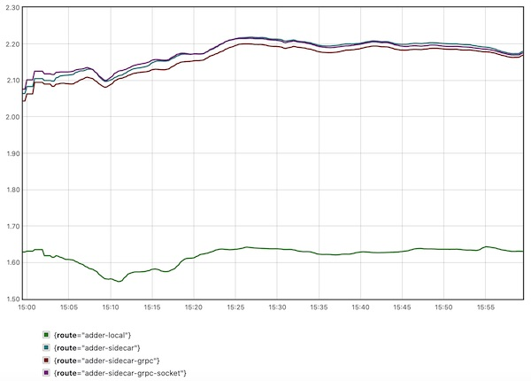
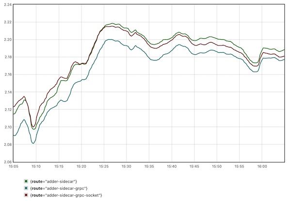

# to-sidecar-or-not

An exploration of the pros and cons of using the sidecar model for common cross-langauge functional needs.

## Contents

- [Project Goals](#project-goals)
- [Project Layout](#project-layout)
- [Running the Experiment](#running-the-experiment)
- [Conclusions](#conclusions)
- [Limitations](#limitations)
- [Next Steps](#next-steps)

## Project Goals

The primary goal of this project is to determine the pros and cons (from a performance perspective only) of using a sidecar to expose common functionality in heterogenous language environments (i.e., places that use more than one language). This approach has been proposed to avoid duplicating library code across different languages.

I compare the client-side latency when an endpoint uses a local method versus a call out to a sidecar via either REST over HTTP or gRPC over IPC (Unix sockets). As a side effect, I seek to show how to instrument Go code with Prometheus in ways that give useful insight into the performance of the application.

## Project Layout

The project is entirely written in Go, and structured similarly to what's described in Ben Johnson's [Structuring Applications in Go](https://medium.com/@benbjohnson/structuring-applications-in-go-3b04be4ff091) article.

There are four services currently built by the code in this repository:

* **[Server](cmd/server/main.go):** A RESTful service that exposes four different routes to calculate the sum of two numbers:
  * `/adder`: Calculates the number using pure in process code.
  * `/adder-with-sidecar`: Calculates the number by calling out to a sidecar that exposes the same `/adder` endpoint and returning the result.
  * `/adder-with-sidecar-grpc`: Calculates the number by calling out to a sidecar using gRPC over HTTP.
  * `/adder-with-sidecar-grpc-socket`: Calculates the number by calling out to a sidecar using gRPC over IPC (Unix sockets).

  The service exposes the following Prometheus metrics:
  * `server_response_time`: Measures the time to process the request from the server side. The value with the label `stage='total'` represents the entire time of the request process, whereas the label `stage='calc'` is only the time to actually calculate the result (i.e. no marshalling / unmarshalling of the request to the server itself). The label `route` indicates which of the four published routes was called.
* **[RESTful sidecar](cmd/sidecar/main.go):** Exposes the same `/adder` endpoint as the main service.
* **[gRPC sidecar](cmd/sidecar/grpc/main.go):** Exposes a gRPC `Add` method. The protocol def files for this are under the [`proto`](proto/) path.
* **[Client](cmd/client/main.go):** A client that simultaneously calls all four endpoints of the Server service.

  The service exposes the following Prometheus metrics:
  * `client_response_time`: Measures the time from when the client initiated the response to the time the response is competely received. The label `route` indicates which of the published Server routes was called.

In addition, the supporting files include:

* **[Kubernetes manifests](kubernetes/):** For deploying the set of services in Kubernetes.
* **[Helmfile](helmfile/):** Contains a [helmfile](https://github.com/helmfile/helmfile) that deploys Prometheus, which is used to observe the performance of the various approaches.

## Running the Experiment

Follow these steps to setup and run the project locally.

### Pre-Requisites

* The instructions here assume you are running on a Mac (sorry Windows / Linux folks).
* You must have Docker installed.

### Setup

* Run `make setup` to install all required tools.

### Executing

* Run `make start-experiment-kind`, which:
  * Builds Docker images for all of the various project components using [goreleaser](https://goreleaser.com/).
  * Creates a [`kind`](https://kind.sigs.k8s.io/) cluster locally.
  * Creates a deployment of all the project components.
  * Installs Prometheus using [helmfile](https://github.com/helmfile/helmfile).
* Start a port forwarding session to the Prometheus service: `kubectl port-forward svc/prometheus-server 9090:80`.

>**NOTE:** To get the best data, wait for > 5 minutes to allow data to be collected.

### Observations

**There is a clear difference observed between the methods that are all local versus those that call to the sidecar.**

Browse to [this URL](http://localhost:9090/graph?g0.expr=quantile(0.95%2C%20(avg_over_time(client_response_time_sum%5B1m%5D)%20%2F%20avg_over_time(client_response_time_count%5B1m%5D))%20*%201000)%20by%20(route)&g0.tab=0&g0.stacked=0&g0.show_exemplars=0&g0.range_input=1h), which shows a graph of the client response times for the various endpoints (i.e. the time from when the client initiates the request to the time the respone is completely read).

On my local setup, over time, the p95 client latency for the non sidecar method (`route="adder-local"`) was around 1.6ms; for the sidecar enabled methods, all three hovered around 2-2.2ms.

**The difference between the REST over HTTP, gRPC over HTTP, and gRPC over IPC methods was not as large as I expected.**

Browse to [this URL](http://localhost:9090/graph?g0.expr=quantile(0.95%2C%20(avg_over_time(client_response_time_sum%7Broute%3D~%22adder-sidecar.*%22%7D%5B1m%5D)%20%2F%20avg_over_time(client_response_time_count%5B1m%5D))%20*%201000)%20by%20(route)&g0.tab=0&g0.stacked=0&g0.show_exemplars=0&g0.range_input=1h) to see the same metrics, but only for the routes which use the sidecar.

I observed that the difference between the different methods was always < 100ns. In addition, surprisingly, the gRPC-over-IPC method was not a clear winner; instead, gRPC-over-HTTP was always the lowest, and some times even REST-over-HTTP beat gRPC-over-IPC!

### Teardown

* Run `make kind stop`

## Conclusions

**The approach of using a language agnostic sidecar for common library functions carries a clear price.** While not very large (<1ms on average), this is still something that needs to be considered for extremely high throughput applications.

**While gRPC appears to perform better overall, the incremental gains appear to be small.** The difference between the slowest (REST-over-HTTP) and the fastest (gRPC over HTTP) methods was well under a millisecond. This means the overhead of adopting gRPC may not always be worthwhile, especially if you are dealing with existing code that is written in the context of a RESTful interface.

## Limitations

**These are some random ideas on why the data I see here may not be generally applicable.**

* The size of the request body passed to the sidecar was _very_ small; as such, the overhead of marshalling / unmarshaling the sidecar request and response, as well as the overhead to transmit the payload and receive the response, was also likely very small. If the payloads were larger, the differences between protocols might be more significant, and the overhead of the entire operation may get larger as well.
* Everything here was written in Go, and as such the performance might vary widely with other languages.
* I am far from a highly skilled Go programmer! My niche has generally been in building tools / utilities, as opposed to high scale concurrent applications, so there may be better ways to code what I've written.

## Next steps

* Try benchmarking the performance of the various methods using much larger payloads, so as to better measure the effect of that variable.
* Further refactoring of the various methods to improve efficiency (suggestions welcome by PR!).
* Document how to collect a more detailed analysis of performance using [`pprof`](https://pkg.go.dev/runtime/pprof), which is currently already present in code for the server process.